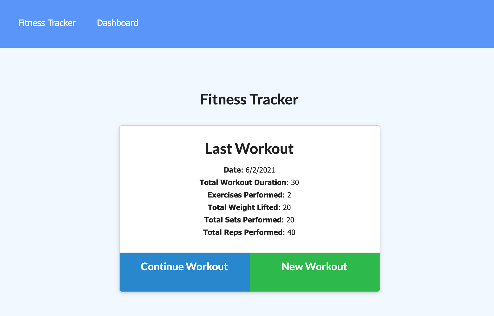

# Track My Workout  

## Table of Contents
1. [Project Overview](#Project-Overview)
2. [MVP](#MVP)
3. [Installation](#Installation)
4. [Usage](#Usage)
5. [Application Screenshots](#Application-Screenshots)
6. [Deployement](#Deployement)
7. [License](#License)
8. [Credit](#Credit)
****

## Project Overview
A simple fitness tracker using MongoDB and Atlas for performing CRUD operations through utilizing NOSQL database flexibility and syntax.

### Project Status:

*COMPLETED*

#### Issues to debug:
* issues exist within the given source code as front-end UI/UX shortfalls
    - both "Compelte" and "Add Exercise" buttons on exercise.html will submit form data
    - toast will indicate same message: "Workout sucessfully added" for both buttons
    - only lastest workout displayed

**Although not the intended purpose for this assignment, lack of font-end user-friendly functions caused some minor confusion.**

****

## MVP

### Project-build Aspects:

The following components are used to build the code for this project:

1. source code provided by T.E.S. (see [credits](#Credit))
2. MongoDB/Robo3T/MongoDB Atlas
3. mongoose.js
4. Express.js
5. Heroku for deployement

### Functionality:

The following lists all functions within this project:

* updating existing workout with new exercises
* creating new workout with new exercises
* viewing stats of last 7 workouts: total duration and combined weights

### Process:
* create database and establish schema
* create document for model constructor `Workout`
* esablishing API: performing CRUD operations using model functions by referring to given front-end JS source code (mainly through `api.js`)

****

## Installation

1. Clone this repository onto local workspace
2. Open Terminal (MacOS) or Git Bash (Windows) and change location to where you want the cloned directory
3. Type `git clone` and paste copied respository
4. Directory should include the following:

5. Node.js is required for this application: download [HERE](https://nodejs.org/en/download/)

**6. IMPORTANT IF RUNNING APPLICATION ON LOCAL SERVER: `.env.EXAMPLE` needs to be renamed to `.env` and follow the instructions within the double //**

## Usage

Running with CLI:

`npm install` : install npm packages

`npm run seed`: seed database

`npm run watch`: to start application on local server *WITH* nodemon

`npm start`: to start application on local server *WITHOUT* nodemon

## Application Screenshots
**Homepage of app with view of last workout and options**

**Exercise page to update or create new workout**

**Stats/Dashboard page to view total duration and combined weight of last 7 workouts**

****

## Deployment
This application is deployed through Heroku @ : https://floating-tundra-55658.herokuapp.com/

****

## License
This application is licensed under MIT - please see the provided LICENSE file included in this repository.

## Credit
* [mongoose.js Documentation](https://mongoosejs.com/docs/index.html)
* [MongoDB 4.4 Documentation](https://docs.mongodb.com/manual/_)
* Full-stack Bootcamp Program @ [Washington University, Saint Louis](https://bootcamp.tlcenter.wustl.edu/) through [© 2021 Trilogy Education Services, LLC, a 2U, Inc. brand](https://www.trilogyed.com/)
